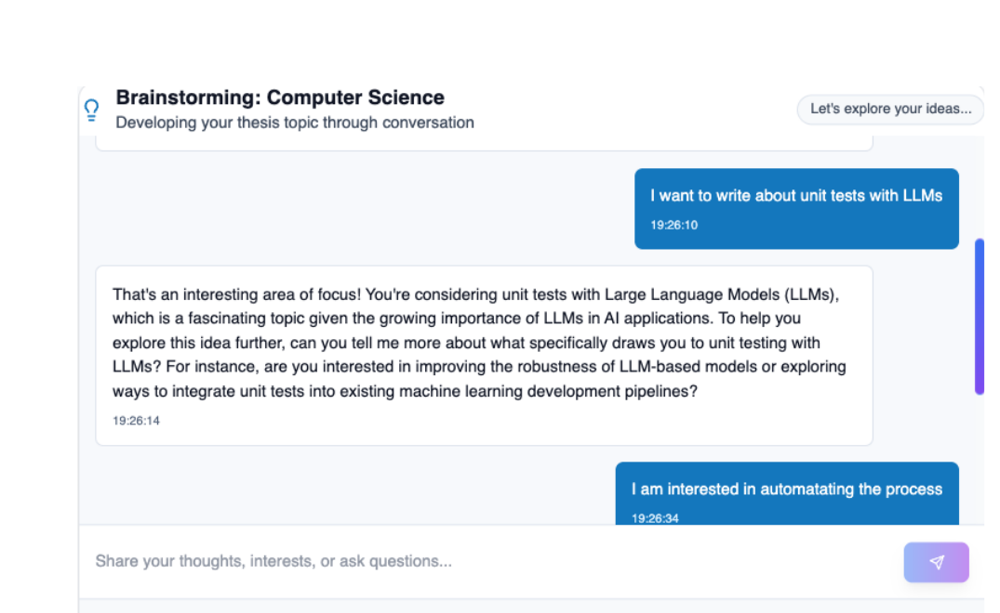
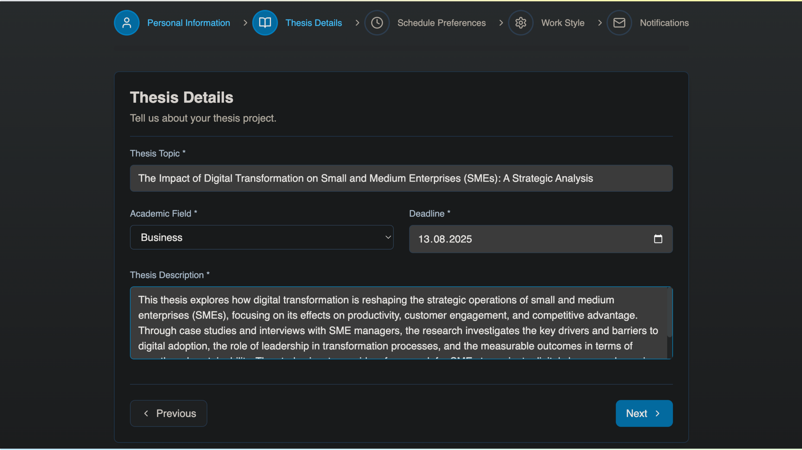
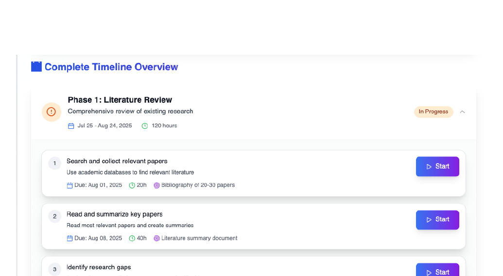
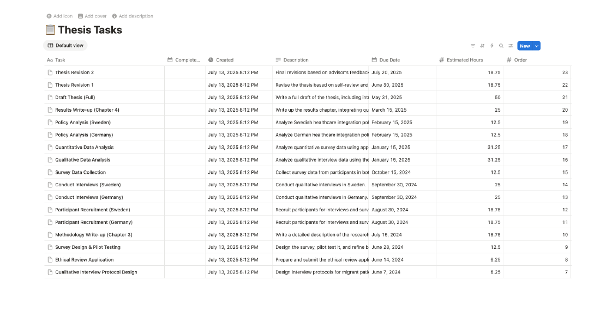
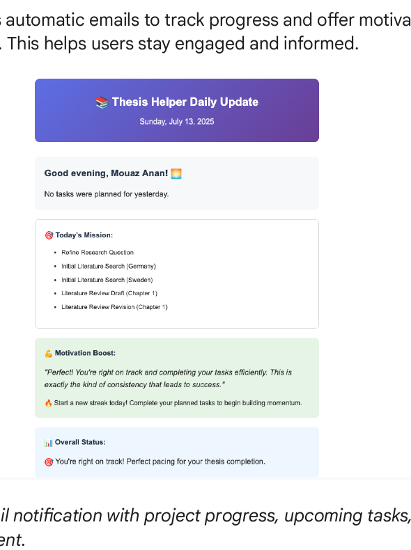
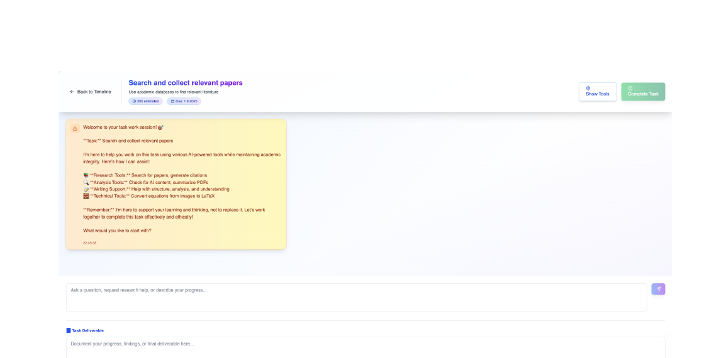
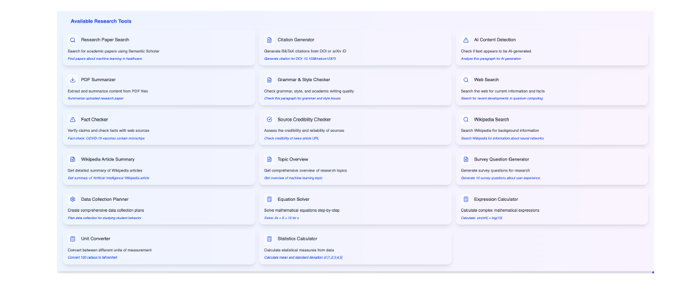
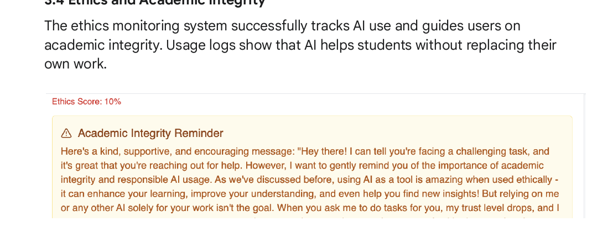

# Thesis Helper

Thesis Helper is an AI-powered thesis planning platform built to help students move from vague ideas to a structured, trackable, and ethically supported research workflow. It combines topic brainstorming, personalized timeline generation, task execution support, Notion syncing, and daily email nudges in one system.

The project was developed as a University of Bonn Team TK thesis-management prototype with a Next.js frontend and a FastAPI backend. It supports both local AI through Ollama and cloud AI through Google Gemini.

## Why It Exists

Students often struggle with the same thesis problems:

- choosing a topic that is specific enough to execute
- breaking a large research project into realistic phases and tasks
- recovering when they fall behind schedule
- knowing which academic tools to use for a specific task
- getting AI support without drifting into academic-integrity risks

Thesis Helper is designed to address those gaps with a guided workflow instead of a single chat box.

## Core Workflow

### 1. Brainstorm a thesis topic

The app starts with a guided brainstorming chat that helps turn rough interests into a focused research direction.



### 2. Capture project constraints

Students then complete a structured questionnaire covering topic details, deadline, schedule, work style, notifications, and AI provider preferences.



### 3. Generate a personalized thesis timeline

The backend turns the questionnaire into a phased plan with milestones, task estimates, daily assignments, and "today's tasks" guidance.



### 4. Sync planning into Notion

Generated timelines can be pushed into a Notion workspace with task databases, milestone tracking, and progress views.



### 5. Stay engaged with daily progress emails

The system can send a daily progress summary with today's tasks, motivation, and status updates.



### 6. Work inside a task-focused assistant

Each thesis task can be opened in a dedicated workspace with chat support, deliverable tracking, and specialized academic tools.





### 7. Add ethical guardrails

The system can surface academic-integrity reminders when AI usage starts drifting toward replacement work instead of support.



## Feature Highlights

- AI brainstorming flow for refining thesis topics
- personalized timeline generation with phases, milestones, and task estimates
- local persistence so thesis projects can be resumed later
- Notion workspace creation and timeline syncing
- daily email summaries and motivational nudges
- task-specific work sessions with 18 academic helper tools
- ethics monitoring to encourage responsible AI usage
- support for local AI with Ollama and cloud AI with Gemini

## Tech Stack

- Frontend: Next.js 14, React 18, TypeScript, Tailwind CSS
- Backend: FastAPI, Pydantic, SQLAlchemy
- Database: SQLite by default, PostgreSQL-compatible configuration
- AI providers: Ollama, Google Gemini
- Integrations: Notion, Gmail SMTP, Semantic Scholar and helper services

## Repository Layout

```text
backend/             FastAPI app, models, services, integrations
frontend/            Next.js UI, components, styles, API client
screenshots/         README/demo assets
docs/                Project notes and status docs
Thesis Helper - TK Team.pdf
Thesis Helper Agent.pdf
```

## Quick Start

### 1. Clone the repository

```bash
git clone https://github.com/ananmouaz/thesis_agent.git
cd thesis_agent
```

### 2. Create and activate a virtual environment

```bash
python -m venv venv
```

macOS/Linux:

```bash
source venv/bin/activate
```

Windows PowerShell:

```powershell
.\venv\Scripts\Activate.ps1
```

### 3. Install backend dependencies

```bash
pip install -r requirements.txt
```

### 4. Install frontend dependencies

```bash
cd frontend
npm install
cd ..
```

### 5. Create your environment file

```bash
cp env.template .env
```

Windows PowerShell:

```powershell
Copy-Item env.template .env
```

Then update `.env` with the values you need:

- `EMAIL_USER` and `EMAIL_PASSWORD` for Gmail delivery
- `NOTION_TOKEN` for Notion workspace creation and syncing
- `GEMINI_API_KEY` if you want to use Gemini instead of Ollama
- `DATABASE_URL` if you want a database other than local SQLite
- `DEBUG` must be `true` or `false`

### 6. Optional: run Ollama locally

```bash
ollama pull llama3.2
ollama serve
```

## Running the App

Start the backend from the `backend/` directory:

```bash
cd backend
python -m uvicorn app.simple_main:app --reload --host 0.0.0.0 --port 8000
```

In a second terminal, start the frontend:

```bash
cd frontend
npm run dev
```

Open the app at:

```text
http://localhost:3000
```

## Environment Notes

- `AI_PROVIDER=ollama` is the default local-first setup.
- If Ollama is not running, cloud generation via Gemini requires a valid `GEMINI_API_KEY`.
- Notion and Gmail features are optional, but the related buttons/actions require valid credentials.
- The default SQLite path is resolved relative to the backend working directory, so start the API from `backend/` if you use the default config.

## Troubleshooting

- If the backend complains about `DEBUG`, set it to `true` or `false` in `.env` instead of values like `release`.
- If timeline generation fails with Ollama, confirm `ollama serve` is running and `llama3.2` is installed.
- If Notion actions fail, verify the integration token and that the integration has access to the target workspace.
- If emails fail, use a Gmail app password instead of a normal account password.

## Project References

Additional project context and presentation material live in:

- [Thesis Helper - TK Team.pdf](<Thesis Helper - TK Team.pdf>)
- [Thesis Helper Agent.pdf](<Thesis Helper Agent.pdf>)

## Status

The repository already contains the core end-to-end experience:

- brainstorming
- questionnaire-driven planning
- timeline generation
- Notion sync
- email progress summaries
- task execution workspace with academic tools

The README screenshots were refreshed from the latest project report and presentation assets in this repository.
